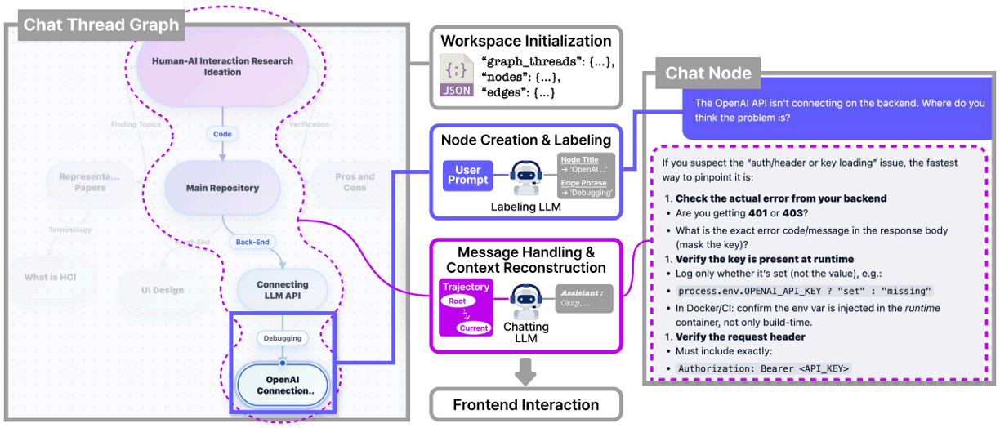
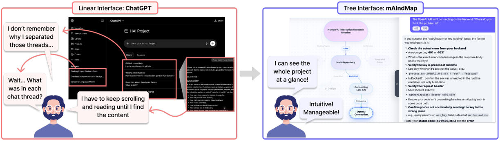

# HAI mAIndMap Prototype

mAIndMap is a tree-based LLM conversation interface for long-running
ideation and problem solving. Instead of keeping every prompt and answer in
one chronological transcript, mAIndMap organizes conversations as editable
mind-map branches. Each node owns a local chat thread, and each edge shows how
one thread branches from another.

## Motivation

Linear chat interfaces work well for short exchanges, but they become fragile
when a task grows into multiple related subtopics. Useful decisions, detours,
drafts, and alternatives can become mixed into one timeline, forcing users to
scroll, search, or restate context when returning to an earlier idea.

mAIndMap addresses this by making the conversation structure visible and
editable. Users can branch from any selected node, keep unrelated subtopics in
separate local threads, and still preserve a global overview of how ideas
relate.

For detailed design rationale and system background, see
[Team Sungdongjin_Final Report.pdf](Team%20Sungdongjin_Final%20Report.pdf).

## Media



System flow from workspace state to node-local chatting.



Simple comparison with a conventional linear chat UI.

[Demo_mAIndMap.mp4](Demo_mAIndMap.mp4): Short demo of branching, chatting, and
node-based navigation.

## Key features

- User-controlled tree topology with one rooted tree per conversation map.
- Freeform mind-map canvas with draggable nodes, panning, zooming, and downward child placement.
- Each node represents a separate local chat thread.
- Users can create child nodes to explore alternative directions without losing the parent thread.
- Node titles are generated from the first user prompt, then can be edited manually.
- Parent-child edges have short phrase-level labels that can also be edited by the user.
- Chatting in a node sends the selected node's current conversation plus the root-to-parent ancestor path.
- Sibling branches and child branches are excluded from the model context by default.
- The chat sidebar keeps a familiar linear chat UI while the tree provides structure.
- The sidebar can be resized or hidden.
- Korean/English UI switching is supported.
- `config.py` controls runtime options. No argparse is used.

## Run

```bash
python -m venv .venv
source .venv/bin/activate
pip install -r requirements.txt
cp .env.example .env
python run.py
```

Open:

```txt
http://127.0.0.1:7860
```

## Test mode

`config.py` has a top-level test switch. The checked-in default is real OpenAI
mode for API smoke testing:

```python
TEST_MODE = False
```

When `TEST_MODE=True`, OpenAI is never called, even if `.env` contains an API key. The app injects deterministic local test doubles through `app/infrastructure/llm/llm_factory.py`, so you can test graph creation, chat flow, node title generation, edge phrase generation, locale switching, and deletion without spending API calls.

To switch back to local deterministic doubles:

```python
TEST_MODE = True
```

For real OpenAI calls, set `.env`:

```txt
OPENAI_API_KEY=sk-...
```

If `TEST_MODE=False` and no key exists, the app fails fast unless this is set
to true:

```python
USE_MOCK_LLM_WHEN_NO_API_KEY = False
```

## Context policy

The key context settings are in `config.py`:

```python
INCLUDE_FULL_ANCESTOR_LINEAGE = True
ANCESTOR_CONTEXT_MESSAGE_LIMIT = 8
CURRENT_THREAD_MESSAGE_LIMIT = 20
```

For a selected node `Root -> A -> B -> C`, chatting in `C` sends:

```txt
- recent messages from C itself
- root-to-parent ancestor context: Root, A, B
- edge phrases along that single path
```

It does not send siblings of A/B/C or children of C.

The implementation is in:

```txt
app/application/context_builder.py
```

## Model separation

OpenAI model names are separated in `config.py`:

```python
OPENAI_CHAT_MODEL = "gpt-5.4-nano"
OPENAI_EDGE_MODEL = "gpt-5.4-nano"
OPENAI_TITLE_MODEL = "gpt-5.4-nano"
```

The chat model handles normal conversation. The edge model only creates short phrase-level edge labels. The title model only creates short node titles/summaries from the first prompt.
For the cheapest end-to-end smoke-test setup, all three are currently set to the same nano model.

Output and reasoning cost controls are also configurable:

```python
OPENAI_REASONING_EFFORT = "none"
OPENAI_TEXT_VERBOSITY = "low"
OPENAI_CHAT_MAX_OUTPUT_TOKENS = 512
OPENAI_LABEL_MAX_OUTPUT_TOKENS = 80
OPENAI_STORE_RESPONSES = False
```

Optional OpenAI web search is exposed in the chat composer as a per-message
toggle. The app only passes the hosted `web_search` tool when that toggle is on
and the backend is running in real OpenAI mode:

```python
OPENAI_WEB_SEARCH_ENABLED = True
OPENAI_WEB_SEARCH_CONTEXT_SIZE = "low"
OPENAI_WEB_SEARCH_MAX_TOOL_CALLS = 1
OPENAI_WEB_SEARCH_TOOL_CHOICE = "required"
OPENAI_WEB_SEARCH_EXTERNAL_ACCESS = True
```

Web search can add tool-call and search-content token costs, so keep the context
size low and tool calls capped unless you intentionally want deeper browsing.
Set `OPENAI_WEB_SEARCH_TOOL_CHOICE = "auto"` if the toggle should merely allow
search instead of forcing it.

## Architecture

```txt
app/
  domain/
    chat.py
    graph.py
    ports.py

  application/
    chat_use_cases.py
    context_builder.py
    graph_use_cases.py
    settings_use_cases.py
    workspace_state.py

  infrastructure/
    llm/
      llm_factory.py
      openai_client_factory.py
      openai_models.py
      fallback_models.py
    persistence/
      json_store.py
      json_repositories.py
    layout/
      tree_layout_service.py

  presentation/
    web/
      routes.py
      static/
        index.html
        styles.css
        app.js
```

Domain/application code depends on interfaces from `app/domain/ports.py`; OpenAI, JSON persistence, layout, and Flask live in infrastructure/presentation layers.

## Main flow

1. Create the root node.
2. Select a node and add a child node.
3. Click a node to open its chat thread in the right sidebar.
4. Send the first prompt.
5. The node title is generated from the first prompt.
6. If the node has a parent, the incoming edge phrase is generated from the parent title, child title, and child first prompt.
7. The user can rename the node or edit the edge phrase manually.

## Notes

- Storage is local JSON at `storage/data.json`.
- Deleting a node deletes its whole subtree and all linked chat messages.
- User-edited node titles and edge phrases are not overwritten by generated labels in that locale.
